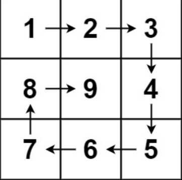

# 59 螺旋矩阵Ⅱ

## 题目

难度：中等

给你一个正整数 n ，生成一个包含 1 到 n2 所有元素，且元素按顺时针顺序螺旋排列的 n x n 正方形矩阵 matrix 。

示例 1：



输入：n = 3
输出：[[1,2,3],[8,9,4],[7,6,5]]
示例 2：

输入：n = 1
输出：[[1]]

提示：

1 <= n <= 20

## 思路

``` c
/**
 * Return an array of arrays of size *returnSize.
 * The sizes of the arrays are returned as *returnColumnSizes array.
 * Note: Both returned array and *columnSizes array must be malloced, assume caller calls free().
 */
int** generateMatrix(int n, int* returnSize, int** returnColumnSizes){
    // 返回的结果数组的大小
    *returnSize = n; // 行数
    *returnColumnSizes = (int*)malloc(sizeof(int) * n); // 列数
    // 返回结果数组 res
    int** res = (int**)malloc(sizeof(int*) * n);  // n 行
    int i;
    for(i = 0; i < n; i++) {
        res[i] = (int*)malloc(sizeof(int) * n);  // 每行 n 列
        (*returnColumnSizes)[i] = n; // 每列中元素个数
    }

    int count = 1; // 用于赋值
    int start_x = 0, start_y = 0; // 每次模拟开始的下标
    int offset = 1; // 最后一个位置交给下一个环节赋值
    int mid = n / 2; // 当 n 为奇数时，中间的一个数单独赋值
    int loop = n / 2; // 画几圈
    int j;
    
    while (loop--) {
        // 最后一个位置交给下一个环节赋值
        // 从左到右
        for (j = start_y; j < n - offset; ++j) {
            res[start_x][j] = count++; 
        }
        // 从上到下
        for (i = start_x; i < n - offset; ++i) {
            res[i][j] = count++; 
        }
        // 从右到左
        for (; j > start_y; --j) {
            res[i][j] = count++;
        }
        // 从下到上
        for (; i > start_x; --i) {
            res[i][j] = count++;
        }
        // 往里缩一圈
        start_x++;
        start_y++;
        offset++;
    }
    
    if (n % 2) res[mid][mid] = count;
    return res;

}
```

## 其他代码

### C++

``` c++
class Solution {
public:
    vector<vector<int>> generateMatrix(int n) {
        vector<vector<int>> res(n, vector<int>(n, 0)); // 定义二维数组
        int count = 1; // 用于赋值
        int start_x = 0, start_y = 0; // 每次模拟开始的下标
        int offset = 1; // 每行、每列的最后一下元素交给下一步赋值
        int loop = n / 2; // 循环次数，画几圈
        int mid = n / 2; // 若 n 为奇数，中间的一个值单独赋值
        int i, j;

        while (loop--) {
            // 从左到右
            for (j = start_y; j < n - offset; ++j) {
                res[start_x][j] = count++;
            }
            // 从上到下
            for (i = start_x; i < n - offset; ++i) {
                res[i][j] = count++;
            }
            // 从右到左
            for (; j> start_y; --j) {
                res[i][j] = count++;
            }
            // 从下到上
            for (; i > start_x; --i) {
                res[i][j] = count++;
            }
            // 往里缩一圈
            start_x++;
            start_y++;
            offset++;
        }
        if (n % 2) res[mid][mid] = count;

        return res;
    }
};
```

### JavaScript

``` javascript
/**
 * @param {number} n
 * @return {number[][]}
 */
var generateMatrix = function(n) {
    let res = new Array(n).fill(0).map(() => new Array(n).fill(0)); // 二维数组
    let start_x = 0, start_y = 0; // 每圈模拟的开始下标
    let offset = 1; // 每行、列的最后一个元素，交给下一步赋值
    let loop = Math.floor(n / 2); // 循环次数
    let mid = Math.floor(n / 2); // 若 n 为奇数，则最后一个值单独赋值
    let count = 1; // 用于赋值
    
    while (loop--) {
        let i = start_x, j = start_y;
        // 从左到右
        for (; j < n - offset; ++j) {
            res[i][j] = count++;
        }
        // 从上到下
        for (; i < n - offset; ++i) {
            res[i][j] = count++;
        }
        // 从右到左
        for (; j > start_y; --j) {
            res[i][j] = count++;
        }
        // 从下到上
        for (; i > start_x; --i) {
            res[i][j] = count++;
        }
        // 往里缩一圈
        start_x++;
        start_y++;
        offset++;
    }
    if (n % 2) res[mid][mid] = count;
    return res;
};
```

### Python3

``` python
class Solution:
    def generateMatrix(self, n: int) -> List[List[int]]:
        res = [[0] * n for _ in range(n)]
        # 每圈的开始下标
        start_x = 0
        start_y = 0
                
        loop = n // 2 # 循环次数
        mid = n // 2 # 由于每行、每列最后一个元素，交由下一步赋值，所以若 n 为奇数，最后一个数需要单独赋值
        count = 1 # 用于赋值

        # offset 的作用是使每行、每列最后一个元素，交由下一步赋值
        # offset 的赋值，自增由 for 循环自己完成
        for offset in range(1, loop + 1):
            # 从左到右
            for j in range(start_y, n - offset):
                res[start_x][j] = count
                count += 1
            # 从上到下
            for i in range(start_x, n - offset):
                res[i][n - offset] = count
                count += 1
            # 从右到左
            # 需要设置步长为 -1
            for j in range(n - offset, start_y, -1):
                res[n - offset][j] = count
                count += 1
            # 从下到上
            # 需要设置步长为 -1
            for i in range(n - offset, start_x, -1):
                res[i][start_y] = count 
                count += 1
            # 往里缩一圈
            start_x += 1
            start_y += 1
        
        if (n % 2) :
            res[mid][mid] = count # n 为奇数，给最后一个元素赋值
        return res
```

### Go

``` go
func generateMatrix(n int) [][]int {
    res := make([][]int, n) // 定义二维数组
    for i := 0; i < n; i++ {
        res[i] = make([]int, n)
    }
    start_x := 0
    start_y := 0 // 定义每圈的开始下标
    loop := n / 2 // 循环次数
    mid := n / 2 // 最后一个变量赋值
    offset := 1 // 控制每行、列最后一个值
    count := 1 // 赋值

    for loop > 0 {
        i := start_x
        j := start_y
        // 从左到右
        for ; j < n - offset; j++{
            res[i][j] = count
            count += 1
        }
        // 从上到下
        for ; i < n - offset; i++ {
            res[i][j] = count
            count += 1
        }
        // 从右到左
        for ; j > start_y; j-- {
            res[i][j] = count
            count += 1
        }
        // 从下到上
        for ; i > start_x; i-- {
            res[i][j] = count
            count++
        }
        // 往里缩一圈
        start_x++
        start_y++
        offset++
        loop--
    }
    if n % 2 == 1 {
        res[mid][mid] = count
    }
    return res
}
```
