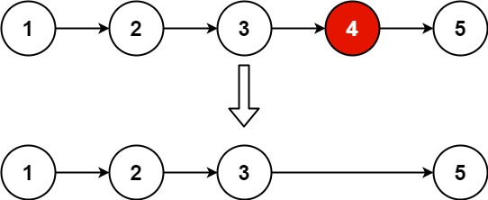

# 19 删除链表的倒数第N个节点

## 题目

[LeetCode 链接](https://leetcode.cn/problems/remove-nth-node-from-end-of-list/)

难度：中等

给你一个链表，删除链表的倒数第 n 个结点，并且返回链表的头结点。

示例 1：


输入：head = [1,2,3,4,5], n = 2
输出：[1,2,3,5]

示例 2：

输入：head = [1], n = 1
输出：[]
示例 3：

输入：head = [1,2], n = 1
输出：[1]

提示：

* 链表中结点的数目为 sz
* 1 <= sz <= 30
* 0 <= Node.val <= 100
* 1 <= n <= sz

## 思路

使用虚拟头节点便于操作
创建两个指针，快指针比慢指针快 n + 1 个节点
当快指针到最后一个节点时，刚好指向待删除节点的前一个

``` cpp
/**
 * Definition for singly-linked list.
 * struct ListNode {
 *     int val;
 *     ListNode *next;
 *     ListNode() : val(0), next(nullptr) {}
 *     ListNode(int x) : val(x), next(nullptr) {}
 *     ListNode(int x, ListNode *next) : val(x), next(next) {}
 * };
 */
class Solution {
public:
    ListNode* removeNthFromEnd(ListNode* head, int n) {
        // 创建虚拟头节点
        ListNode* vir_head = new ListNode(0);
        vir_head->next = head;
        // 创建两个指针，快指针比慢指针快 n + 1 个节点
        // 当快指针到最后一个节点时，刚好指向待删除节点的前一个
        ListNode* slow = vir_head;
        ListNode* fast = vir_head;
        // 快指针先移动 n+1 步
        while (n--) {
            fast = fast->next;
        }
        fast = fast->next;
        // 同时移动快慢指针，使慢指针指向待删除节点的前一个
        while (fast != nullptr) {
            fast = fast->next;
            slow = slow->next;
        }
        // 删除节点
        ListNode* tmp = slow->next;
        slow->next = tmp->next;
        delete tmp;
        return vir_head->next;
    }
};
```

## 其他代码

### Python3

``` python
# Definition for singly-linked list.
# class ListNode:
#     def __init__(self, val=0, next=None):
#         self.val = val
#         self.next = next
class Solution:
    def removeNthFromEnd(self, head: Optional[ListNode], n: int) -> Optional[ListNode]:
        # 创建虚拟节点
        vir_head = ListNode(0)
        vir_head.next = head
        # 创建快慢两个指针
        # 快指针比满指针快 n + 1
        # 使慢指针刚好指向待删除节点的前一个
        fast = vir_head
        slow = vir_head
        # 移动快指针
        for _ in range(n):
            fast = fast.next
        fast = fast.next
        # 同时移动两个指针，使慢指针指向待删除节点的前一个
        while (fast != None):
            fast = fast.next
            slow = slow.next
        slow.next = slow.next.next
        return vir_head.next
```
