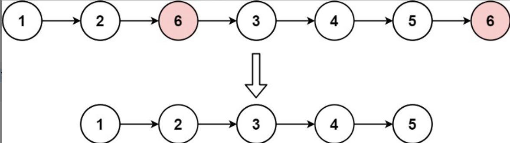

# 203 移除链表元素

## 题目

难度：简单

给你一个链表的头节点 head 和一个整数 val ，请你删除链表中所有满足 Node.val == val 的节点，并返回 **新的头节点** 。



示例 1：

输入：head = [1,2,6,3,4,5,6], val = 6
输出：[1,2,3,4,5]
示例 2：

输入：head = [], val = 1
输出：[]
示例 3：

输入：head = [7,7,7,7], val = 7
输出：[]

提示：

列表中的节点数目在范围 [0, 104] 内
1 <= Node.val <= 50
0 <= val <= 50

## 思路

### 直接在原链表进行操作

先处理头节点是待删除节点的情况，再处理其他节点
需要使用两个辅助节点
也可以先不考虑头节点，删除其他元素，最后判断头节点是不是需要删除

``` c
// 法一  先处理头节点是待删除节点的情况，再处理其他节点
/**
 * Definition for singly-linked list.
 * struct ListNode {
 *     int val;
 *     struct ListNode *next;
 * };
 */


struct ListNode* removeElements(struct ListNode* head, int val){
    // 在原来的链表处理
    struct ListNode* tmp;
    
    // 处理头节点需要删除的情况
    while (head && head->val == val) {
        // 头节点的值是要删除的元素，删除头节点
        tmp = head;
        head = head->next;
        free(tmp);
    }

    // 处理其他节点需要删除的情况
    struct ListNode* cur = head;
    // 当 cur 存在并且 cur->next 存在时
    while (cur && cur->next != NULL) {
        tmp = cur->next;
        if (tmp->val == val) { // tmp 节点的值等于要删除的值
            // 删除 tmp 节点
            cur->next = tmp->next;
            free(tmp);
        } else {
            // cur 后移
            cur = tmp;
        }
    }

    return head;
}


// 法二 先不考虑头节点，删除其他元素，最后判断头节点是不是需要删除
/**
 * Definition for singly-linked list.
 * struct ListNode {
 *     int val;
 *     struct ListNode *next;
 * };
 */


struct ListNode* removeElements(struct ListNode* head, int val){
    struct ListNode* tmp; // 用于删除元素
    struct ListNode* cur = head; // 用于遍历列表

    // 处理头节点以外的节点
    // cur 为空时，cur->next 不存在
    while (cur && cur->next != NULL) {
        if (cur->next->val == val) {
            tmp = cur->next;
            cur->next = tmp->next;
            free(tmp);
        } else {
            cur = cur->next;
        }
    }
    // 判断头节点是否需要删除
    // 头节点为空时，head->val 不存在
    if (head && head->val == val) {
        tmp = head;
        head = head->next;
        free(tmp);
    }
    return head;
}
```

### 创建一个节点，指向头节点

前一种方法法二的变种

``` c
/**
 * Definition for singly-linked list.
 * struct ListNode {
 *     int val;
 *     struct ListNode *next;
 * };
 */


struct ListNode* removeElements(struct ListNode* head, int val){
    // 创建新的头节点
    typedef struct ListNode ListNode;
    struct ListNode* newh;
    newh = (ListNode *)malloc(sizeof(ListNode));
    newh->next = head;

    // 处理其他节点需要删除的情况
    ListNode* tmp;
    ListNode* cur = newh;
    while (cur->next != NULL) {
        if (cur->next->val == val) {
            tmp = cur->next;
            cur->next = tmp->next;
            free(tmp);
        } else {
            cur = cur->next;
        }
    }
    head = newh->next;
    free(newh);
    return head;
}
```

### 递归

第一种方法法二的递归写法

``` c
struct ListNode* removeElements(struct ListNode* head, int val) {
    if (head == NULL) {
        return head;
    }
    head->next = removeElements(head->next, val);
    return head->val == val ? head->next : head;
}
```

## 其他代码

都用第一种写法的法二实现

### C++

``` c++
/**
 * Definition for singly-linked list.
 * struct ListNode {
 *     int val;
 *     ListNode *next;
 *     ListNode() : val(0), next(nullptr) {}
 *     ListNode(int x) : val(x), next(nullptr) {}
 *     ListNode(int x, ListNode *next) : val(x), next(next) {}
 * };
 */
class Solution {
public:
    ListNode* removeElements(ListNode* head, int val) {
        ListNode* tmp; // 指向待删除节点
        ListNode* cur = head; // 用于遍历链表

        // 先处理头节点以外的节点
        while (cur && cur->next != NULL) {
            if (cur->next->val == val) {
                tmp = cur->next;
                cur->next = tmp->next;
                delete tmp;
            } else {
                cur = cur->next;
            }
        }

        // 单独处理头节点
        if (head && head->val == val) {
            tmp = head;
            head = tmp->next;
            delete tmp;
        }
        return head;
    }
};
```

### Python3

``` python
# Definition for singly-linked list.
# class ListNode:
#     def __init__(self, val=0, next=None):
#         self.val = val
#         self.next = next
class Solution:
    def removeElements(self, head: Optional[ListNode], val: int) -> Optional[ListNode]:
        cur = head

        # 先处理头节点以外的节点
        while (cur and cur.next != None) :
            if (cur.next.val == val) :
                cur.next = cur.next.next
            else :
                cur = cur.next
        
        # 单独处理头节点
        if (head and head.val == val) :
            head = head.next
        return head
```

### Go

``` go
/**
 * Definition for singly-linked list.
 * type ListNode struct {
 *     Val int
 *     Next *ListNode
 * }
 */
func removeElements(head *ListNode, val int) *ListNode {
    cur := head

    // 处理头节点之外的节点
    for cur != nil && cur.Next != nil {
        if cur.Next.Val == val {
            cur.Next = cur.Next.Next
        } else {
            cur = cur.Next
        }
    }

    // 单独处理头节点
    if head != nil && head.Val == val {
        head = head.Next
    }
    return head
}
```
