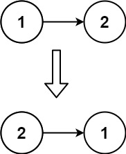

# 206 反转链表

## 题目

[LeetCode 链接](https://leetcode.cn/problems/reverse-linked-list/)
难度：简单
给你单链表的头节点 head ，请你反转链表，并返回反转后的链表。
 
示例 1：


输入：head = [1,2,3,4,5]
输出：[5,4,3,2,1]

示例 2：

输入：head = [1,2]
输出：[2,1]
示例 3：

输入：head = []
输出：[]

提示：

* 链表中节点的数目范围是 [0, 5000]
* -5000 <= Node.val <= 5000

## 思路

修改链表指向，需要两个指针，一个指向当前需要修改指向的节点，一个指向前一个节点，还需要一个临时指针存储当前指针修改前的下一个节点

``` c++
/**
 * Definition for singly-linked list.
 * struct ListNode {
 *     int val;
 *     ListNode *next;
 *     ListNode() : val(0), next(nullptr) {}
 *     ListNode(int x) : val(x), next(nullptr) {}
 *     ListNode(int x, ListNode *next) : val(x), next(next) {}
 * };
 */
class Solution {
public:
    ListNode* reverseList(ListNode* head) {
        ListNode* cur = head;
        ListNode* pre = NULL; // 原本的头节点指向 NULL
        ListNode* tmp; // 保存 cur 下一个节点
        while (cur) {
            tmp = cur->next;
            cur->next = pre;
            pre = cur;
            cur = tmp;
        }
        return pre; // 循环结束后，pre 为新的头节点
    }
};
```

## 其他代码

### Python3

``` python
# Definition for singly-linked list.
# class ListNode:
#     def __init__(self, val=0, next=None):
#         self.val = val
#         self.next = next
class Solution:
    def reverseList(self, head: Optional[ListNode]) -> Optional[ListNode]:
        cur = head
        pre = None # 原本的头节点指向 None
        while cur != None :
            tmp = cur.next # 方便遍历链表
            cur.next = pre
            pre = cur
            cur = tmp
        return pre # 循环结束后，pre 为头节点
```
