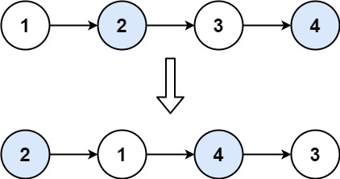

# 24 两两交换链表中的节点

## 题目

[题目链接](https://leetcode.cn/problems/swap-nodes-in-pairs/)

难度：中等

给你一个链表，两两交换其中相邻的节点，并返回交换后链表的头节点。你必须在不修改节点内部的值的情况下完成本题（即，只能进行节点交换）。

示例 1：


输入：head = [1,2,3,4]
输出：[2,1,4,3]

示例 2：

输入：head = []
输出：[]

示例 3：

输入：head = [1]
输出：[1]

提示：

* 链表中节点的数目在范围 [0, 100] 内
* 0 <= Node.val <= 100

## 思路

使用虚拟头节点，可以不用单独考虑头节点
交换一次移动两个节点
cur 指向虚拟头节点
交换两个节点

``` c++
node1 = cur->next;
ListNode* node2 = cur->next->next;
cur->next = node2;
node1->next = node2->next;
node2->next = node1;
cur = node1;
```

错误写法

``` c++
ode1 = cur->next
node2 = cur->next->next
cur->next = node2
cur->next->next = node1  // node2->next = node1 
cur->next->next->next = node2->next // node1->next = node1，进入死循环
cur = cur->next->next
```

交换的条件是 cur->next != nullptr 且 cur->next->next != nullptr
若 cur->next->next == nullptr，则后面只有一个元素无需交换
若 cur->next == nullptr，则后面没有元素无需交换

完整 C++ 代码如下

``` c++
/**
 * Definition for singly-linked list.
 * struct ListNode {
 *     int val;
 *     ListNode *next;
 *     ListNode() : val(0), next(nullptr) {}
 *     ListNode(int x) : val(x), next(nullptr) {}
 *     ListNode(int x, ListNode *next) : val(x), next(next) {}
 * };
 */
class Solution {
public:
    ListNode* swapPairs(ListNode* head) {
        // 创建虚拟头节点
        ListNode* vir_head = new ListNode(0);
        vir_head->next = head;
        // cur 指向虚拟头节点
        ListNode* cur = vir_head;
        
        while (cur->next != nullptr && cur->next->next != nullptr) {
            // 指向需要交换的两个节点
            ListNode* node1 = cur->next;
            ListNode* node2 = cur->next->next;
            cur->next = node2;
            node1->next = node2->next;
            node2->next = node1;

            cur = node1;  // 交换一次移动两节点  等价于 cur = cur->next->next
        }
        return vir_head->next;
    }
};
```

## 其他代码

### Python3

``` python

```
