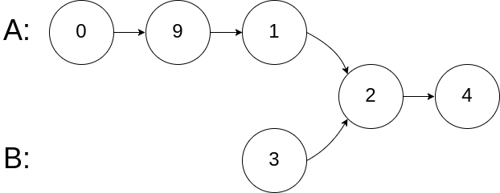
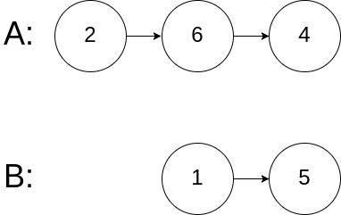

# 面试题 02.07. 链表相交

## 题目

[LeetCode 链接](https://leetcode.cn/problems/intersection-of-two-linked-lists-lcci/)

难度：简单

给你两个单链表的头节点 headA 和 headB ，请你找出并返回两个单链表相交的起始节点。如果两个链表没有交点，返回 null 。

图示两个链表在节点 c1 开始相交：

题目数据 保证 整个链式结构中不存在环。

注意，函数返回结果后，链表必须 保持其原始结构 。

示例 1：


输入：intersectVal = 8, listA = [4,1,8,4,5], listB = [5,0,1,8,4,5], skipA = 2, skipB = 3
输出：Intersected at '8'
解释：相交节点的值为 8 （注意，如果两个链表相交则不能为 0）。
从各自的表头开始算起，链表 A 为 [4,1,8,4,5]，链表 B 为 [5,0,1,8,4,5]。
在 A 中，相交节点前有 2 个节点；在 B 中，相交节点前有 3 个节点。

示例 2：


输入：intersectVal = 2, listA = [0,9,1,2,4], listB = [3,2,4], skipA = 3, skipB = 1
输出：Intersected at '2'
解释：相交节点的值为 2 （注意，如果两个链表相交则不能为 0）。
从各自的表头开始算起，链表 A 为 [0,9,1,2,4]，链表 B 为 [3,2,4]。
在 A 中，相交节点前有 3 个节点；在 B 中，相交节点前有 1 个节点。
示例 3：



输入：intersectVal = 0, listA = [2,6,4], listB = [1,5], skipA = 3, skipB = 2
输出：null
解释：从各自的表头开始算起，链表 A 为 [2,6,4]，链表 B 为 [1,5]。
由于这两个链表不相交，所以 intersectVal 必须为 0，而 skipA 和 skipB 可以是任意值。
这两个链表不相交，因此返回 null 。

提示：

* listA 中节点数目为 m
* listB 中节点数目为 n
* 0 <= m, n <= 3 * 104
* 1 <= Node.val <= 105
* 0 <= skipA <= m
* 0 <= skipB <= n
* 如果 listA 和 listB 没有交点，intersectVal 为 0
* 如果 listA 和 listB 有交点，intersectVal == listA[skipA + 1] == listB[skipB + 1]

## 思路

交点不是数值相等，是指针相等

### 方法一 哈希集合

首先遍历链表 headA，将 headA 中的每个节点都加入哈希集合中，然后遍历链表 headB，对于每个遍历到的节点，判断该节点是否在哈希集合中，如果不在，继续遍历；如果在，返回该节点。如果 headB 中所有节点都不在哈希集合中，则两个链表不相交，返回 null
时间复杂度：O(m + n)
空间复杂度：O(m) m 是 headA 的长度

``` cpp
/**
 * Definition for singly-linked list.
 * struct ListNode {
 *     int val;
 *     ListNode *next;
 *     ListNode(int x) : val(x), next(NULL) {}
 * };
 */
class Solution {
public:
    ListNode *getIntersectionNode(ListNode *headA, ListNode *headB) {
        // 创建哈希集合
        unordered_set <ListNode *> visited;
        // 用于遍历节点
        ListNode* tmp = headA;
        while (tmp != NULL) {
            visited.insert(tmp); // 将 headA 中的节点加入到哈希集合中
            tmp = tmp->next;
        }
        // 查看 headB 中的节点有没有在哈希集合中
        tmp = headB;
        while (tmp != NULL) {
            if (visited.count(tmp)) {
                return tmp;
            }
            tmp = tmp->next;
        }
        return NULL;
    }
};
```

### 方法二 双指针

相交节点后面的长度一定相等
先计算两个链表长度
遍历长度比较长的链表至剩余长度与短的相等
一起遍历并比较两个链表的剩余部分，相等则返回，否则返回空

``` cpp
/**
 * Definition for singly-linked list.
 * struct ListNode {
 *     int val;
 *     ListNode *next;
 *     ListNode(int x) : val(x), next(NULL) {}
 * };
 */
class Solution {
public:
    ListNode *getIntersectionNode(ListNode *headA, ListNode *headB) {
        // 计算两个链表长度
        int lenA = 0, lenB = 0;
        ListNode* curA = headA;
        ListNode* curB = headB;
        while (curA != NULL) {
            lenA++;
            curA = curA->next;
        }
        while (curB != NULL) {
            lenB++;
            curB = curB->next;
        }

        // 假定比较长的是 A
        curA = headA;
        curB = headB;
        if (lenA < lenB) {
            swap(lenA, lenB);
            swap(curA, curB);
        }

        // 遍历长的到长度相等
        int gap = lenA - lenB;
        while (gap--) {
            curA = curA->next;
        }
        // 比较剩余部分，若相等则返回对应节点
        while (curA != NULL) {
            if (curA == curB) {
                return curA;
            }
            curA = curA->next;
            curB = curB->next;
        }
        return NULL;
    }
};
```

## 其他代码

### Python3

双指针

``` python
# Definition for singly-linked list.
# class ListNode:
#     def __init__(self, x):
#         self.val = x
#         self.next = None

class Solution:
    def getIntersectionNode(self, headA: ListNode, headB: ListNode) -> ListNode:
        # 计算两个链表长度
        lenA = 0
        lenB = 0
        curA = headA
        curB = headB
        while (curA != None) :
            curA = curA.next
            lenA += 1
        while (curB != None) :
            curB = curB.next
            lenB += 1
        # 假定比较长的为 A
        curA = headA
        curB = headB
        if (lenA <  lenB) :
            tmp = curB
            curB = curA
            curA = tmp
            tmp1 = lenB
            lenB = lenA
            lenA = tmp1
        # 遍历到剩余长度相等
        gap = lenA - lenB
        while (gap) :
            curA = curA.next
            gap -= 1
        # 比较剩余部分，若相等则返回对应节点
        while (curA != None) :
            if (curA == curB) :
                return curA
            curA = curA.next
            curB = curB.next
        return None
```
