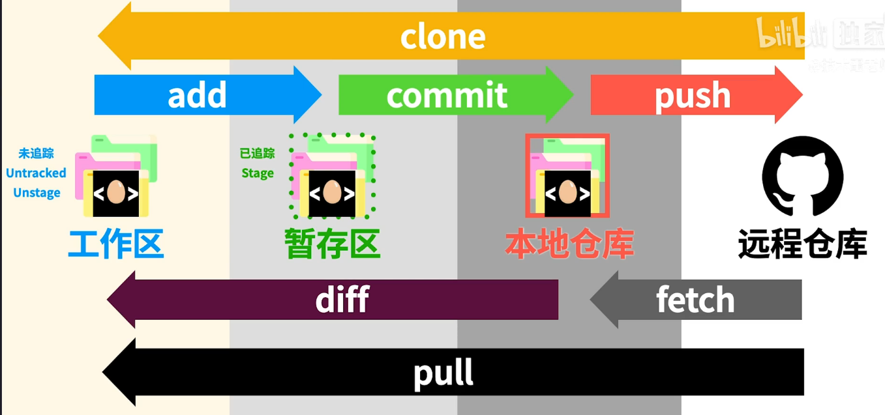

* 整体流程
  * 
* git 配置
  * `git config --global user.name xxxx`
  * `git config --global user.emal xxxx`
* 开启版本控制
  * `git init`
  * 会生成 .git 文件夹，版本存在该文件里
* 查看当前状态
  * `git status`
  * 随时可以使用
* 添加到暂存区
  * `git add filename`
* 添加到本地仓库
  * `git commit`
  * 可以使用 `git -am "commit content"` 同时进行附加和简短的提交信息
* 查看前面版本
  * `git log`
  * 查看谁提交的、提交时间
* 不需要提交的文件
  * 生成 `.gitignore` 文件， 在该文件中输入文件名称即可
  * 本地别的分支删除 .gitignore 中的文件，本地其他分支也会没有
* 创建新分支
  * `git branch branch-name`
* 切换分支
  * `git checkout branch-name`
  * `git checkout -b branch-name` 创建并进入一个新分支
* 删除分支
  * `git branch -d branch-name`
  * `git branch -D branch-name`
* 合并分支
  * `git merge other-branch`
* 远程 -> 本地
  * `git clone xxx.com`
  * github 的主分支为 main
  * 本地仓库发主分支为 master
* 查看本地仓库与哪些远程仓库有联系
  * `git remote -v`
* 更新到远程仓库
  * `git push`
  * github 需使用 token
* 将远程仓库拉到本地仓库
  * `git fetch`
  * 可以指定远程仓库和分支名
* 对比远程仓库与本地仓库的区别
  * `git diff remote-name/branch-name`
* 远程仓库内容整合到工作区
  * `git pull`